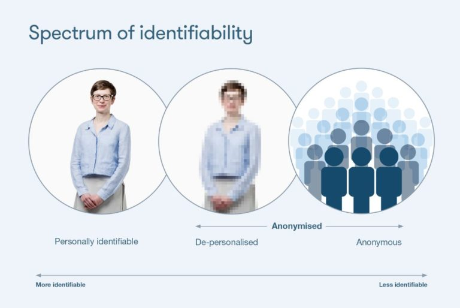
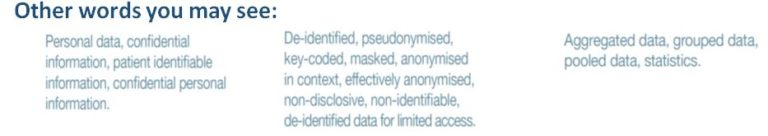

# Data Glossary
The following definitions and explanations are derived from a number of sources, including  [Understanding Patient Data](https://understandingpatientdata.org.uk/)  and  [Review of Data Security, Consent and Opt-Outs](https://www.gov.uk/government/publications/review-of-data-security-consent-and-opt-outs)  by The National Data Guardian for Health and Care.

People want to know whether they could be identified when data about them is used.  However, the technical language of identifiability is complex, with many different words used to describe the same thing, and many of those words are unnecessarily technical.  The following diagram provides some examples:

**Glossary**
**Access control:** A means of ensuring that the people who have been given access to all or part of a data record have been approved to do so.  Different controls are in place for data sharing.

**Aggregated data:** Statistical data about several individuals that has been combined to show general trends or values without identifying individuals within the data (see also anonymised grouped data).

**Anonymisation:** The process of rendering data into a form which does not identify individuals either directly or indirectly and where identification is not likely to take place by any means reasonably likely (see also de-personalised data).

**Anonymised grouped data**: Statistical data about several individuals that has been combined to show general trends or values without identifying individuals within the data (see also aggregated data).

**Audit trail:** An audit trail (or log) records anyone who has viewed or changed a record, why and when they did so and what changes they made.

**Caldicott Guardian:** A senior person in an organisation responsible for protecting the confidentiality of patient and service user information and enabling appropriate information sharing by providing advice to professionals and staff.

**Care pathway:** A document agreed by all disciplines involved in the care of a specific group of patients (such as patients who have suffered a stroke), which outlines the agreed standards for treatment, based on the best available evidence.  It makes clear what different tasks (interventions) need to be done by which professionals, when and where.

**Carer:** An individual who provides unpaid care to a patient or service user, most commonly a member of their family or friend. (For paid workers, see care worker).

**Care record:** Care records are personal records which identify an individual (whether living or dead) and which can be held electronically, in a paper file or a combination of both. They include data relating to:
* the individual’s physical or mental health;
* the individual’s social care needs and services
* any counselling or assistance given or to be given to the individual by professional or voluntary organisations

**Care team:** The health and/or social care professionals and staff that directly provide or support care to an individual.

**Care Worker:** An individual who is paid to care for a service user. (For people who are not paid for their services, see carers).

**Clinical audit:** Clinical audit is a method for improving practice, patient care or services provided. It is used to compare current practice with a set of standards or criteria, then identify areas for improvement, make changes to practice and re-audit to ensure that improvement has been achieved.

**Commissioning (and commissioners):** Commissioning is essentially buying care in line with available resources to ensure that services meet the needs of the population. The process of commissioning includes assessing the needs of the population, selecting service providers and ensuring that these services are safe, effective, people-centred and of high quality. Commissioners are responsible for commissioning services.

**Confidential data or information:** See Personally identifiable data.

**Common Law:** The law derived from decisions of the courts and case law, rather than Acts of Parliament or other legislation.  For example, the common law duty of confidentiality which applies to data about both living and dead people.

**Confidentiality:** Ensuring that information is only made available or disclosed to authorised individuals, or organisations.

**Consent:** see Explicit consent and Implied consent.

**Controller:** A term used to describe an individual or organisation who determines the purposes for which and the manner in which any personally identifiable data is or will be processed. It is the responsibility of the Controller to ensure that any processing of personally identifiable data is lawful.

**Data:**see Patient data. N.B. The word ‘data’ is used in the singular throughout, to promote clarity of understanding.

**Data breach:**Any failure to meet the requirements of the Data Protection Act, unlawful disclosure or misuse of personally identifiable data and an inappropriate invasion of people’s privacy.

**Data Controller:**See Controller.

**Data loss:** a term that is used when personally identifiable data is lost, inappropriately accessed or corrupted, either by accident or on purpose.  This could either be a breach of the  [Data Protection Act](https://www.connectedhealthcities.org/community/glossary-data-use/dataprotectionact)  or an inappropriate breaking of confidentiality.

**Data Processor:** See Processor.

**Data Subject:**An identifiable living person described in personal data who has certain rights under the Data Protection Act (2018).
* [Data Protection Act (2018)](http://www.legislation.gov.uk/ukpga/2018/12/contents/enacted)  Data protection legislation for the UK which governs the handling and protection of personally identifiable data relating to living people. It includes specific rights for individuals, such as rights to know and correct what data is held about them. It supercedes the  [Data Protection Act (1998)](https://www.legislation.gov.uk/ukpga/1998/29/contents)  and stipulates additional legal obligations under the European Union’s GDPR. For example, controllers need to be transparent with individuals about how their data are processed, keep records of data processing, provide individuals with access to their data free of charge, Data Protection Impact Assessments, and hold contracts for the personally identifiable data they will hold and process.

**Data Protection Impact Assessment:**A systematic and comprehensive process for determining the privacy, confidentiality and security risks associated with the collection, use and disclosure for Personally Identifiable Patient Data prior to the introduction of or a change to a policy, process or procedure. Completing a DPIA is a legal requirement for controllers of any high risk data processing. Its aim is to balance the proposed data processing and the rights of individuals in the Data Protection Act. Prior to the Data Protection Act 2018 these were optional and were called Privacy Impact Assessments.

**Data Protection Officer:** See also Information Governance Specialist. An independent officer responsible for advising an organisation on how to ensure they comply with the Data Protection Act 2018, and meeting the individual’s rights. The DPO is the key contact point between the organisation and the supervisory authority.

**Data security:** Protecting data and information systems from unauthorised access, use, disclosure, disruption, modification or destruction.

**Data sharing:**The disclosure of data from one or more organisations to another organisation or organisations, or the sending of data between different parts of a single organisation. This can take the form of routine data sharing, where the same data sets are shared between the same organisations for an on-going established purpose; and exceptional, one-off decisions to share data for a specific purpose.

**Data Sharing Contract and Agreements**: a group of documents that sets out the common set of rules to be adopted by the various organisations involved in data sharing.  A data sharing contract establishes the rules that will apply to the processing of any data by partner organisations.  A data sharing agreement relates to the flow of data between partner organisations for a specific purpose.  There is often one data sharing contract and multiple data sharing agreements between partner organisations.

**De-anonymisation:**See Re-identification.

**De-identification**: See De-personalised data.

**De-personalised data:**This is information that does not identify an individual, because identifiers or  [identifiable data](https://www.connectedhealthcities.org/community/glossary-data-use/identifiabledata)  have been scrambled or removed from the non-identifiable information about the person it relates to. However, the information is still about an individual person and so needs to be protected. It might, in theory, be possible to re-identify the individual if the data was not adequately protected, for example if it was combined with different sources of information.

**Duty of Confidentiality:** A duty of confidentiality (or confidence) arises when one person discloses information to another (e.g. patient to clinician) in circumstances where it is reasonable to expect that the information will be held in confidence. It is a:
1. legal obligation that is derived from common law;
2. requirement established either within professional codes of conduct and/or that must be included within relevant employment contracts. It is also linked to disciplinary procedures through both these requirements.

**Explicit consent**: a freely given, specific, informed and unambiguous indication of the individual’s wishes e.g. regarding data use. There must be some form of clear affirmative action – or in other words, a positive opt-in.  Explicit consent cannot be inferred from silence, pre-ticked boxes or inactivity (see also Implied consent).

**Freedom of Information Act (2000)**: this places a legal responsibility on public bodies to publish information about their activities and also to provide information (but not personally identifiable data) in response to a written request from a member of the public.  N.B. A written request from a member of the public for personally identifiable data that is held about them is made under the Data Protection Act, not the Freedom of Information Act.

* [General Data Protection Regulation (GDPR)](https://gdpr-info.eu/)  The General Data Protection Regulation 2016/679 is a regulation in EU law on data protection and privacy for all individuals within the European Union and the European Economic Area. It also addresses the export of personal data outside the EU and EEA areas and all personal data processed by organisations established in the EU.

**Identifiable information:** See ‘Personally identifiable data’.

**Identifier:** An item of data, which by itself or in combination with other data, enables an individual to be identified.

**Implied consent:**an unwritten agreement between the patient and the health and social care professionals that provide their care that allows their data to be shared as long as it is relevant for their care, it is kept confidential and the patient has not objected.  It is only valid where a reasonable person would expect it to be shared, such as when there is a legitimate relationship.

**Independent audit:** An audit conducted by an external and therefore independent auditor to provide greater public assurance. See Clinical audit.

**Indirect care:** purposes other than individual care of the patient.  This includes activities that contribute to the overall provision of services to a population as a whole or a group of patients with a particular condition. It also covers health services management, preventative medicine, and medical research. Examples of such activities would be risk prediction and stratification, service evaluation, needs assessment, and financial audit.

**Individual care**: A clinical, social or public health activity concerned with the prevention, investigation and treatment of illness and the alleviation of suffering of an identified individual.

**Information:** see Patient Information

**Information governance:** this is how organisations manage the way that any data is handled within the health and social care system in England. It covers the policy and legal requirements that organisations need to meet to ensure that data is handled legally, securely, efficiently, effectively and in a manner which maintains public trust.

**Information governance specialist:** A staff member specifically appointed to provide advice, guidance and governance in relation to legal requirements such as the duty of confidentiality and the Data Protection Act and the legal basis for information sharing.  In addition, they provide advice on the key requirements in relation to information security, record management, and freedom of information. Under the new Data Protection Act these specialists may become or may be assisted by the ‘Data Protection Officer’.

**Legitimate relationship:** The legal relationship that exists between an individual and the health and social care professionals and staff providing or supporting their care.

**Linkage:** The merging of information or data from two or more sources, with the object of combining facts concerning an individual or an event, which are not available in any separate record.

**Medical record**: see Care Record

**Metadata:** Descriptions about data, for example how many records, quality of certain details, or where further information can be found. These are sometimes organised and made available in a catalogue for browsing by those interested in applying to access the data.

**Patient data:** Data that is collected about a patient whenever they go to a doctor or receive social care. It may include details about the individual’s physical or mental health, such as height and weight or detail of any allergies, and their social care needs and services received. It may also include next of kin information. This is recorded and stored in a care record.

**Patient record**: see Care record

**Personally identifiable patient data**: This term describes personal information about identified or identifiable individuals, which should be kept private or secret.  It includes the definition of personal data in the Data Protection Act, but also includes data relating to people who have died and information given in confidence under the Duty of Confidentiality.

**Personal confidential data:** see personally identifiable patient data

**Personal data:** According to the Data Protection Act, this is data that relates to a living individual who can be identified from this data, or from a combination of this data and other data which is in the possession of, or is likely to come into the possession of, the controller. See also Personally identifiable patient data.

**Personal information:** See Personally identifiable patient data.

**Personal record/personal health and wellbeing record:** See Care record.

**Potentially identifiable:** See De-personalised data.

**Primary care:** Primary care refers to services provided by organisations such as GP practices, dental practices, community pharmacies and high street optometrists.

**Privacy Impact Assessment:** See Data Protection Impact Assessment.

**Processing:** Processing in relation to patient data, means obtaining, recording or holding the data or carrying out any operation or set of operations on the data, including, for example:
* organisation, adaptation or alteration
* retrieval, consultation or use
* disclosure, dissemination or otherwise making available, or
* deletion or destruction.

**Processor:** A term used to describe any person or organisation (other than an employee of the Controller) who processes personally identifiable data on behalf of the Controller. Controllers must choose to have a written contract (detailing the information governance requirements) in place and have effective means on monitoring, reviewing and auditing their processing.

**Pseudonym:**  a unique identifier (sometimes created by scrambling an actual identifier), which does not itself reveal an individual’s ‘real world’ identity but distinguishes between different individuals in a data set

**Pseudonymisation:** The process of distinguishing individuals in a data set by using a unique identifier, which does not reveal their ‘real world’ identity (see also Anonymisation and De-personalised data).

**Public interest:** Something ‘in the public interest’ is something that serves the interests of society as a whole. The ‘public interest test’ is used to determine whether the benefit of disclosing personally identifiable patient data outweighs both the personal interest of the individual concerned and the need to protect the public’s trust in the confidentiality of services.

**Re-identification:** The process of analysing data or combining it with other data which results in individuals becoming identifiable. Also known as de-anonymisation.

**Special category personal data:** According to the Data Protection Act (2018), this is data that identifies a living individual regarding his or her: racial or ethnic origin, political opinions, religious beliefs or other beliefs of a similar nature, membership of a trade union, physical or mental health or condition, sexual life, generic data and biometric data convictions, legal proceedings against the individual or allegations of offences committed by the individual. Therefore, this also includes data that is owed a duty of confidentiality. This list contains genetic data and biometric data which are additional items beyond what the Data Protection Act (1998) called sensitive data.

**Service user:** An individual receiving social care services.

**Supervisory authority:** An organisation that regulates data protection in all countries that have implemented the GDPR. The supervisory authority makes sure that any organisation processing personal data upholds data subject rights and complies with the GDPR. In the UK this authority is the Information Commissioner.